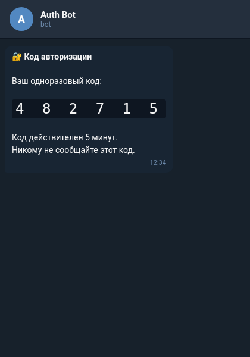

<div align="center">

# tgauth

**Telegram-based OTP authentication system**

[](LICENSE)
[]()
[]()
[]()

</div>

Authentication service that uses Telegram as the OTP delivery channel. An approved user requests a one-time code from a Telegram bot, then enters it on a web page to verify their identity. The bot handles admin approval of new users and per-user resource assignments; a separate FastAPI service exposes a `POST /verify` endpoint that validates a code and returns a session token.

## ■ Features

- ❖ **Telegram OTP** — one-time codes generated by the bot (`secrets.token_hex`) and delivered over Telegram
- ❖ **Code verification** — time-limited, single-use codes (default 5 min in the verify API, 10 min in the bot)
- ❖ **Admin approval** — first user becomes admin; new users are approved or declined via inline buttons
- ❖ **Resource access control** — admin grants/revokes per-user resources with `/manage`; users check theirs with `/resources`
- ❖ **FastAPI verify endpoint** — `POST /verify` validates a code and returns a session token
- ❖ **Flask auth routing** — `/auth` form route plus per-resource redirect routes

## ■ Stack

| Component | Technology |
|-----------|------------|
| Bot | Python (pyTelegramBotAPI) |
| Verify API | FastAPI + Pydantic |
| Auth routing | Flask |

## ■ Repository Structure

```
backend/
  main.py     FastAPI app — POST /verify, in-memory code store
  bot.py      Telegram bot (telebot) — approval, code generation, resources
  server.py   Flask routes — /auth form and per-resource redirects
frontend/     placeholder package
```

## ■ Usage

```bash
# Verify API (FastAPI — module exposes `app`, run with uvicorn)
cd backend && uvicorn main:app

# Telegram bot configuration (read from env in bot.py):
#   TELEGRAM_BOT_TOKEN, ADMIN_CHAT_ID,
#   WEB_SERVER_HOST, WEB_SERVER_PORT, CODE_EXPIRATION_TIME
```

## ■ Screenshots



## ■ License

MIT © [pluttan](https://github.com/pluttan)
